<h1 align="center">navin-engine</h1>

<p align="center"><b>Your agent writes the patch. This proves it.</b></p>

<p align="center">
  <a href="https://github.com/navinspire-ai/navin-engine/actions/workflows/ci.yml"></a>
  <a href="https://github.com/navinspire-ai/navin-engine/releases/latest"></a>
  <a href="LICENSE"></a>
  <a href="https://www.rust-lang.org"></a>
  <a href="docs/mcp.md"></a>
  
</p>

An AI coding agent can produce a plausible change in seconds. Nothing in that
loop tells you whether the service still survives a restart under load, or
whether the "optimization" actually made anything faster. `navin-engine` is
the missing half: it boots your app in a throwaway git worktree, attacks it,
measures it, applies a candidate patch, measures again, and reports what
changed with numbers instead of adjectives.

<p align="center">
  
</p>

## AI proposes. Navin proves.

| | |
| --- | --- |
| **Isolated** | Every candidate runs in a disposable git worktree. Your working tree is never written to. |
| **Measured** | Baseline and candidate under identical load, repeated to separate a real gain from noise. |
| **Regression-gated** | Break one passing test, answer one byte differently on replayed traffic, and the candidate is rejected however fast it is. |
| **Certified** | An accepted change gets an Ed25519-signed certificate of the measurements that earned it, re-verifiable by anyone. |

- **Zero configuration.** Start command, test command and local URL are
  detected. The URL is not guessed: the app is booted once and watched until
  it opens a port.
- **Any local target.** HTTP services out of the box - several routes, POST
  bodies and auth headers via `[target]` - and port-less workers or CLIs
  through `kind = "worker"`, where every timed invocation of your
  `exercise_cmd` is a data point.
- **No model, no API key.** The engine measures and gates; where candidate
  patches come from is your choice. In an AI coding tool, they come from the
  model you are already talking to.
- **Runs anywhere MCP runs.** Cursor, Claude Code, Codex, Gemini CLI,
  OpenCode, Antigravity, Windsurf, or plain shell in CI. Born inside the
  Navin desktop app, extracted so any project can embed it.

## 30-second install

```bash
npx -y navin-engine inspect
```

That prints what the engine detected about your project, after fetching and
caching the binary for your platform, checksum verified. No Rust toolchain
involved.

Prefer to own the binary? Prebuilt executables for Linux (x64, ARM64), macOS
(Apple Silicon, Intel) and Windows are attached to every
[release](https://github.com/navinspire-ai/navin-engine/releases/latest), each
with its SHA-256 next to it. Put one on your `PATH` and you are done: nothing
to install beyond `git`. From source, `cargo build --release` with Rust 1.87
or newer.

## Use it from your AI coding tool

Register the engine as an MCP server. In Cursor, `.cursor/mcp.json`:

```json
{
  "mcpServers": {
    "navin-engine": {
      "command": "npx",
      "args": ["-y", "navin-engine", "mcp"]
    }
  }
}
```

With the binary already on your `PATH`, `"command": "navin-engine"` and
`"args": ["mcp"]` do the same thing without going through npm.

In Claude Code, one command:

```bash
claude mcp add navin-engine -- navin-engine mcp
```

Codex, Gemini CLI, OpenCode, Antigravity, Windsurf, Zed and CI are covered in
[docs/hosts.md](docs/hosts.md), including the timeout settings that matter,
because a proof takes minutes rather than seconds.

Then just ask: *"diagnose this service and fix the worst finding"*. The engine
reports evidence; your agent applies the winner with its own edit tools.

## Real proof

A 50-line catalogue API that rebuilds and re-serialises its payload on every
request. Three candidates, `optimize --objective p95`, two benchmark windows
each. Nothing below is illustrative:

```
baseline                  P95 55.8 ± 1.3 ms    277 RPS   robustness 100/100

cache-the-payload         P95  8.0 ± 2.7 ms   1502 RPS   -85.7%   proven
drop-half-the-catalogue   P95  8.0 ms         1476 RPS   -85.7%   rejected, a test broke
shorten-the-sleep         P95 49.6 ± 0.4 ms    310 RPS   -10.9%   beaten

winner   cache-the-payload   -85.7% P95, +441% throughput
branch   navin/evolve/optimize-p95-1787059566
proof    Ed25519 certificate: signature_ok, checksum_ok, gate_valid
```

The second candidate was the interesting one. It hit the same 85.7% by
returning half the catalogue, and no amount of speed saved it: the project's
own test suite failed, so the gate threw it out. That is the whole product in
one line.

## How the loop works

```
   diagnose            your agent            fix / optimize          promote
      |                     |                      |                    |
 boot, attack,        writes 2 to 6         each candidate in      winner on its
 explain each     ->  independent      ->   its own worktree:  ->  own branch,
 failure with a       candidates for        proved, tested,        certificate
 stable id            one finding           benchmarked            signed
```

1. `diagnose` boots the app, breaks it (load, restart, dependency loss) and
   returns findings with stable ids, a symptom, a root cause and a remediation
   direction.
2. Your agent writes patches for one finding. Independent alternatives, not
   steps of one change.
3. `fix` applies each candidate in its own shadow worktree, re-proves it, runs
   your test suite, and accepts it only if it resolves the finding without
   regressing anything else.
4. `optimize` does the same for speed: a baseline, then each variant under
   identical load, repeated to estimate noise. A variant wins only if it beats
   the baseline by more than the noise, keeps the tests green, and answers
   byte-identically on replayed traffic.

The full wire protocol, argument by argument, is in
[docs/mcp.md](docs/mcp.md).

## Tools

| Tool | What it does |
| --- | --- |
| `inspect_project` | How the project builds, tests and starts, per unit. Cheap, read-only. |
| `prove` | Fault injection against the running app; verdict plus a robustness score. |
| `diagnose` | A proof, explained: findings with ids you can act on. |
| `fix` | Verify your candidate patches against one finding. |
| `optimize` | Benchmark performance variants against the unmodified code. |
| `evolve` | Autopilot, for projects that configure their own candidate generator. |
| `promotions` | Changes the engine accepted, each with a signed certificate. |
| `open_pull_request` | Push a promotion's branch and open a PR carrying its evidence. |
| `verify_certificate` | Re-check a promotion's gate, checksum and signature. |

## Read it, then ship it

Every report carries the unified `diff` of what each candidate changed,
rejected ones included, captured with git inside the shadow before it is
destroyed. A measurement can be reviewed instead of believed.

An accepted change lands on its own branch, never on yours (without git, it
lands in a patch bundle under `.navin/promotions/<id>/` with the new files
next to the current ones they replace). From there:

```bash
navin-engine promotions                                # what was accepted, and why
navin-engine pr --id promo-optimize-p95-1787059566     # push the branch, open the PR
navin-engine merge --id promo-optimize-p95-1787059566  # or fast-forward locally
navin-engine rollback --id promo-optimize-p95-1787059566
```

`pr` opens the pull request with the GitHub CLI when it is installed, and its
body is the evidence: measured before and after, the gate decision, and the
command to re-verify the certificate. Without `gh` the branch is still pushed
and a compare link is handed back, so the last step is one click. No token is
ever stored.

## Use it from the shell

Every tool is also a subcommand, printing JSON on stdout and logs on stderr:

```bash
navin-engine inspect                 # what the engine detected
navin-engine proof --profile deep    # robustness verdict
navin-engine diagnose                # findings
navin-engine fix --finding crash.load --candidates patches.json
navin-engine optimize --objective p95 --candidates variants.json
```

`--start`, `--url` and `--test` exist for the rare case where detection picks
the wrong program in a monorepo. You should not need them.

## How it stays safe

**Shadow isolation.** Each run gets a git worktree under `.navin/evolve/`,
with installed dependencies (`node_modules`, `.venv`, `vendor`) lent by
symlink so the app starts as it does in your checkout. Nothing outside that
worktree is written, and it is destroyed afterwards.

**Detection.** A `Procfile`, unit scripts (`package.json`, `pyproject.toml`,
`Cargo.toml`, `go.mod`, `pom.xml`, `composer.json`, ...) and a `Makefile` are
read in that order, and every plausible start command is tried until one opens
a port. The port is observed from the OS and matched to the process group the
engine spawned, so a monorepo with several servers cannot confuse it.

**Proof.** Profiles `quick`, `standard` and `deep` inject progressively more
faults: sustained load, process kill and recovery, dependency loss, resource
pressure. Each fault checks invariants (did it survive, did it recover, did
the error rate stay bounded) and the report is only as strong as its weakest
check.

**Gate.** A candidate is accepted when it resolves the target finding, adds no
new high-severity finding, keeps the test suite and your declared business
invariants green, and does not regress latency. Every decision carries its
reasons.

**Diagnosis.** Failures are explained by correlating proof checks with a
catalogue of log signatures (panics, OOM, port conflicts, fd exhaustion,
resets, SQLite contention, stack overflows, ...). The catalogue is yours to
extend: `[[signatures]]` entries in `.navin/evolve.toml` turn any log line
your app can produce into a finding with a stable id.

**Certificates.** An accepted change is committed with an Ed25519-signed
certificate of the measurements that justified it, so a promotion can be
re-verified later by anyone: `navin-engine verify-cert . --id <promotion>`.

## Configuration

Everything above works with no configuration. `.navin/evolve.toml` is there
for the parts only you can decide:

```toml
[evolve]
enabled = true         # default: accepted changes land on their own branch
                       # (or in a patch bundle without git); false = measure only

[target]               # optional: what the probes exercise
probe_paths = ["/health", "/api/items"]   # extra routes probed in rotation
probe_method = "POST"                     # default GET
probe_body = '{"q": "test"}'
[target.probe_headers]
Authorization = "Bearer test-token"       # authenticated APIs are fair game

[[invariants]]         # business truths that must survive every patch
name = "checkout works"
command = "npm run test:checkout"

[[signatures]]         # your own log signatures, next to the built-ins
marker = "circuit breaker open"
id = "breaker_open"
family = "reliability"
cause = "the payment circuit breaker tripped under load"

[evolve.generator]     # optional: your own candidate generator
command = ""           # a program reading a finding on stdin, writing candidates on stdout
```

Promotions never merge by themselves in the default safe mode: an accepted
change becomes a branch to review. Set `enabled = false` to forbid even that
and keep the engine a pure measuring instrument.

### Workers and CLIs (no port)

A queue consumer, a cron worker or a CLI daemon has no URL to probe. Declare
it and it becomes measurable anyway:

```toml
[target]
kind = "worker"
health_cmd = "redis-cli ping"          # exit 0 = healthy (optional)
exercise_cmd = "python enqueue_one.py" # one unit of work, timed under load
```

Health is process liveness plus `health_cmd`. Load runs `exercise_cmd` in
concurrent loops and times every invocation, so `optimize` compares variants
of a worker with the same statistics it uses for HTTP latency. Wire-level
faults (malformed input, connection floods, network chaos) are recorded as
skipped rather than silently dropped.

## Artefacts

```
.navin/
  proofs/<commit>.json        robustness reports
  diagnoses/<commit>.json     findings
  fixes/<commit>.json|.md     candidate attempts, diffs and gate decisions
  optimize/<commit>.json|.md  benchmark runs
  promotions/<id>.json|.md    accepted changes and certificates
  evolve/                     shadow worktrees, daemon socket, state
```

JSON is the source of truth (`schema` field on every file). The `.md`
sibling is the same measurement in a page an agent or a person can open
in the IDE. Add `.navin/` to your `.gitignore`, or commit the reports if
you want proof history in the repository.

## Requirements

- Linux, macOS or Windows
- an app that runs on this machine: an HTTP service on localhost (probes
  refuse any other host, by design - chaos belongs in a sandbox, not in
  production) or a port-less worker via `[target] kind = "worker"`
- `git` is recommended, not required: with it, shadows are worktrees and
  accepted changes become branches; without it, shadows fall back to a copy
  and accepted changes become reviewable patch bundles under
  `.navin/promotions/`

## Docs

- [docs/hosts.md](docs/hosts.md): wiring into Cursor, Claude Code, Codex,
  Gemini CLI, OpenCode, Antigravity, Windsurf, Zed, CI.
- [docs/mcp.md](docs/mcp.md): the MCP protocol, tool by tool.
- [CHANGELOG.md](CHANGELOG.md): what changed, release by release.

## Contributing

Issues and pull requests are welcome. `cargo test` and
`cargo clippy --all-targets -- -D warnings` are what CI runs, and both should
be clean before you open one. New behaviour comes with a test that would fail
without it.

## Team

navin-engine is built at [Navinspire IA](https://navinspire.ai).

<p>
  <a href="https://github.com/aymenghad"></a>
  <a href="https://github.com/anisf"></a>
  <a href="https://github.com/Amira-ben-henda-eiagen"></a>
  <a href="https://github.com/hasseniImen"></a>
  <a href="https://github.com/maryem955"></a>
  <a href="https://github.com/medkhalilklai"></a>
  <a href="https://github.com/SkanderBS2024"></a>
  <a href="https://github.com/yosra-wanen"></a>
  <a href="https://github.com/nabilmersni2"></a>
</p>

[aymenghad](https://github.com/aymenghad) · [anisf](https://github.com/anisf) · [Amira-ben-henda-eiagen](https://github.com/Amira-ben-henda-eiagen) · [hasseniImen](https://github.com/hasseniImen) · [maryem955](https://github.com/maryem955) · [medkhalilklai](https://github.com/medkhalilklai) · [SkanderBS2024](https://github.com/SkanderBS2024) · [yosra-wanen](https://github.com/yosra-wanen) · [nabilmersni2](https://github.com/nabilmersni2)

## License

MIT. See [LICENSE](LICENSE).
